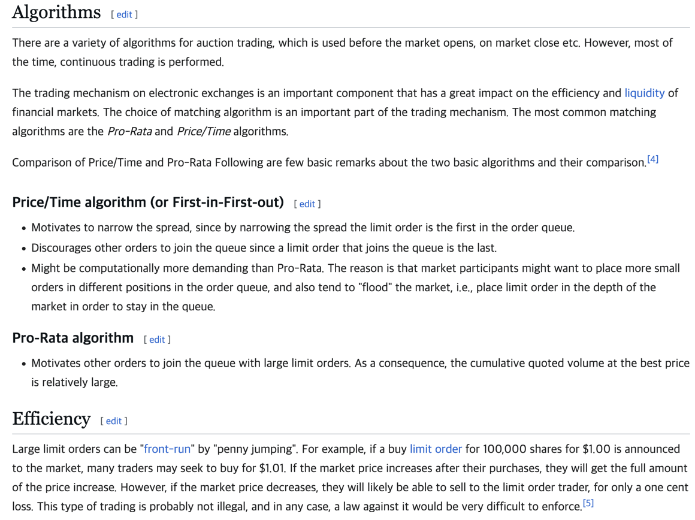

# 매칭 시스템 

### 주문 대기 데이터를 Redis 에 sorted sets 자료 구조로 저장 

- 키 : orderbook.{buy:sell}.{ticker} - string 
- value : {"orderId":UUId, "quantity":100, "price":20000.00}
- score : price - double
- algorithm : Price/Time algorithm - 추후에 여러 알고리즘 비교 예정

(출처 : Order matching system Wikipedia)

## 매칭 시스템이 돌아가는 동안 http 요청 응덥아 지연되는 현상 발생 

### Threads

**scheduling** : *trade order matching*

**http-nio** : *web http request*
- scheduling-1 : 2025-01-10T15:34:58.781479500 start
- scheduling-1 : 2025-01-10T15:34:59.961499200 end
-
- scheduling-1 : 2025-01-10T15:35:03.773056100  start
- scheduling-1 : 2025-01-10T15:35:04.707145300 end
-
- scheduling-1 : 2025-01-10T15:35:08.772429300 start
- scheduling-1 : 2025-01-10T15:35:09.717637700 end
-
- http-nio-4131-exec-2 : 2025-01-10T15:35:11.294201
- http-nio-4131-exec-2 : 2025-01-10T15:35:13.146458600
- scheduling-1 : 2025-01-10T15:35:13.767576300 start
- scheduling-1 : 2025-01-10T15:35:14.705914300 end
-
- scheduling-1 : 2025-01-10T15:35:18.776294800 start
- http-nio-4131-exec-4 : 2025-01-10T15:35:19.138447900
- scheduling-1 : 2025-01-10T15:35:19.721903400 end
-
- http-nio-4131-exec-4 : 2025-01-10T15:35:20.794809500
- http-nio-4131-exec-6 : 2025-01-10T15:35:23.086321200
- scheduling-1 : 2025-01-10T15:35:23.771914600 start
- scheduling-1 : 2025-01-10T15:35:24.710873600 end
-
- http-nio-4131-exec-6 : 2025-01-10T15:35:24.809874100
- scheduling-1 : 2025-01-10T15:35:28.774809300 start
- scheduling-1 : 2025-01-10T15:35:29.638668600 end
-
- scheduling-1 : 2025-01-10T15:35:33.781747300 start
- http-nio-4131-exec-8 : 2025-01-10T15:35:34.525800600
- scheduling-1 : 2025-01-10T15:35:34.698798700 end
-
- http-nio-4131-exec-8 : 2025-01-10T15:35:36.162318400
- scheduling-1 : 2025-01-10T15:35:38.778013200 start

### 해결 1 
한번에 진행되는 전체 매칭 시스템 작업을 나누어서 실행